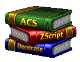

    

    <h5>DoomKit is an extension for Visual Studio Code and introduces modern Doom scripting and lump support.</h5>
    
    

> [!WARNING]  
> **DoomKit is an experimental extension**. It is not yet suitable for use in projects. Content is subject to change, and you may encounter bugs.
